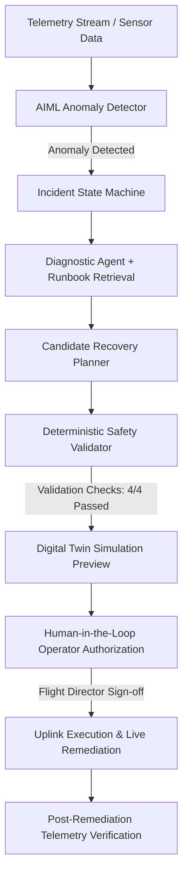

# OrbitGuard — Hackathon Demonstration & Presentation Guide

## Project Summary
**OrbitGuard** is an autonomous spacecraft anomaly detection, root-cause analysis, and recovery system built on the foundational aerospace design principle:

> **"AI recommends; deterministic code decides."**

---

## Complete Pipeline Flow


---

## AI vs. Deterministic Responsibilities

| Responsibility | Component | Authority Level |
| :--- | :--- | :--- |
| **Telemetry Anomaly Detection** | AIML Detector / Backend Filter | Deterministic Thresholds |
| **Root-Cause Hypothesis Generation** | Diagnostic Agent | AI Advisory (Grounded in telemetry only) |
| **Runbook & Historical Precedent Matching** | Knowledge Retriever | AI Advisory (Flight SOP guidelines) |
| **Recovery Plan Candidate Formulation** | Recovery Planner Agent | AI Recommendation |
| **Safety Constraint Verification** | Safety Validator | **Deterministic Hard Gate (Final Authority)** |
| **Action Vocabulary Whitelist** | Orchestrator Guard | Deterministic Whitelist |
| **Command Uplink Authorization** | HITL Flight Director | Operator Ground Approval |
| **Satellite State Remediation** | Simulator Twin Engine | Deterministic Physical Remediation |

---

## 4 Deterministic Safety Constraints
1. **Thermal Action Sequence**: `REDUCE_PAYLOAD_LOAD` must precede `ENTER_SAFE_THERMAL_MODE`.
2. **ADCS Momentum & Attitude Stability**: If wheel jitter > 400 RPM or attitude error > 0.3°, plan must begin with ADCS stabilization (`REDUCE_MANEUVER_ACTIVITY` or `SWITCH_REDUNDANT_SENSOR`).
3. **Battery Power Margin**: Warns and protects bus voltage when < 20.0V or SoC < 30%.
4. **Contingency Rollback**: Every proposed recovery plan must define a deterministic rollback procedure.

---

## Live Demo Step-by-Step Script

### Option A: Web Dashboard (Visual UI)
1. Open **`http://127.0.0.1:8001/`** in your browser (or connect from any LAN device).
2. Click **"Low Battery"**, **"High Temp"**, or **"Wheel Deg"** to inject an anomaly.
3. Observe live telemetry jump out of bounds and the Incident register automatically.
4. Click **"Trigger Multi-Agent RCA & Planning"** to view evidence-grounded diagnosis and retrieved flight runbooks.
5. Review candidate plans and see the **Safety Validator (1.0 SAFE)** badge.
6. Click **"Simulate Twin"** to preview forward temperature/momentum decay curves.
7. Click **"Approve"** and **"Execute"** to dispatch recovery commands.
8. Watch the telemetry stabilize and status transition to **RESOLVED**.

### Option B: Automated Terminal Script
Run the automated end-to-end demo:
```bash
python tests/test_demo_scenario.py
```

### Option C: Quantitative Benchmark Suite
Run the quantitative benchmark suite:
```bash
python -m ai_ml.evaluation.run_benchmark
```

---

## Fallback Demo Path
If the live server network is unavailable:
1. Run `python tests/test_regression_edge_cases.py` to demonstrate 9/9 deterministic safety & edge case verifications offline.
2. Inspect `data/benchmark_results.json` and `data/hackathon_evidence.json` for verified test run metrics.
